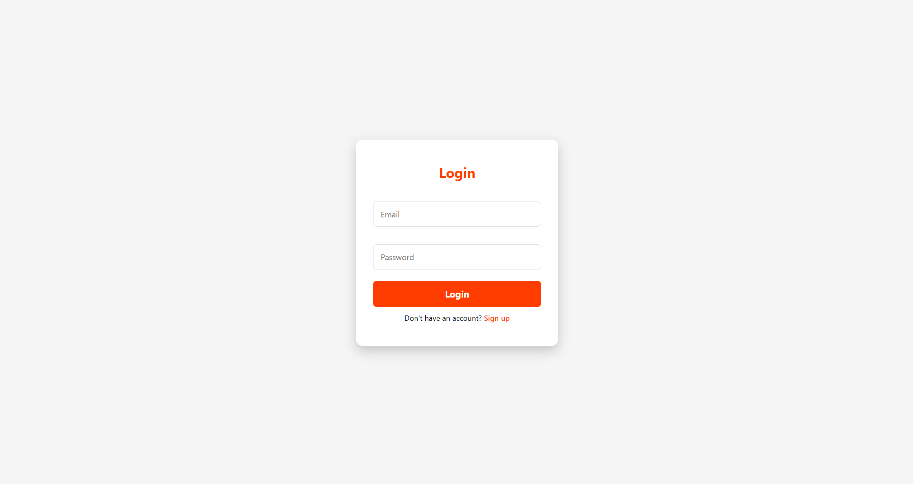

# 🍔 FoodExpress – Food Delivery Application

**FoodExpress** is a full-stack food delivery web application designed to provide a seamless online food ordering experience. Users can browse restaurants, view menus, place orders, manage their profile, and track their order history.

---

## 🔹 Features

- **User Authentication** – Secure login and registration using J2EE and Servlets  
- **Restaurant & Menu Browsing** – Dynamically fetches restaurant and menu data from the database  
- **Order Management** – Place orders and view full order history  
- **Profile Management** – Update and manage user profile information  
- **Responsive UI** – Clean and user-friendly interface using HTML, CSS, and JavaScript  

---

## 🛠️ Tech Stack

- **Frontend:** HTML, CSS, JavaScript  
- **Backend:** Java (J2EE, Servlets)  
- **Database:** MySQL (using JDBC for connectivity)  
- **Architecture:** DAO Design Pattern  

---

## 🚀 Installation & Setup

1. **Clone the repository:**

```bash
git clone https://github.com/KRISHNAPEYYALA19/Food-Express-Application.git
## 📷 Screenshots

## Screenshots

### 🔐 Login Page



