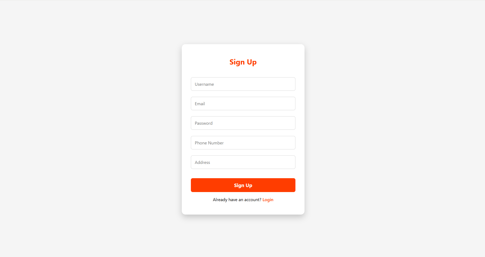
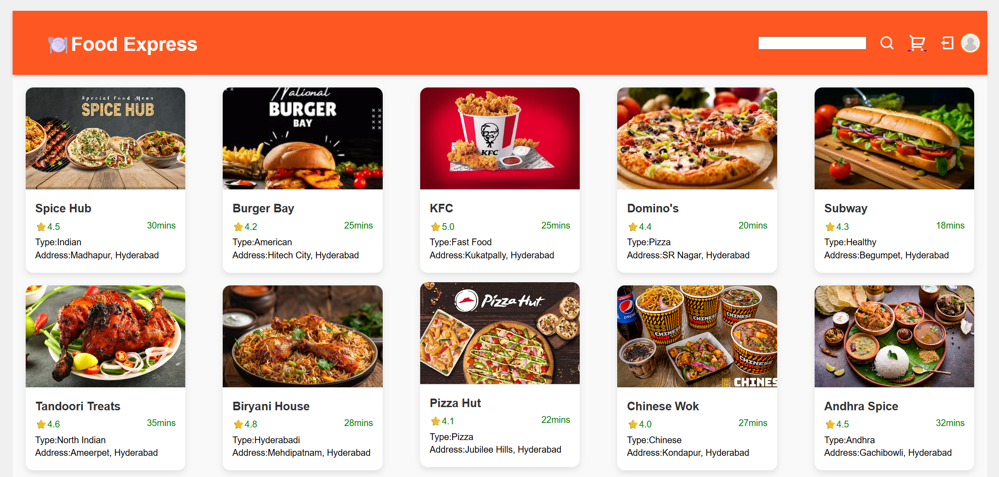
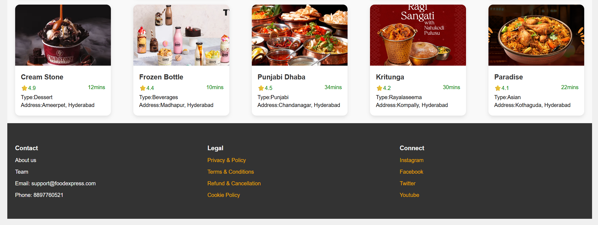
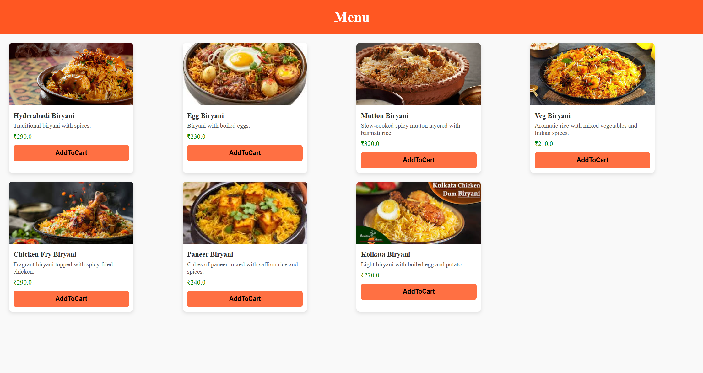
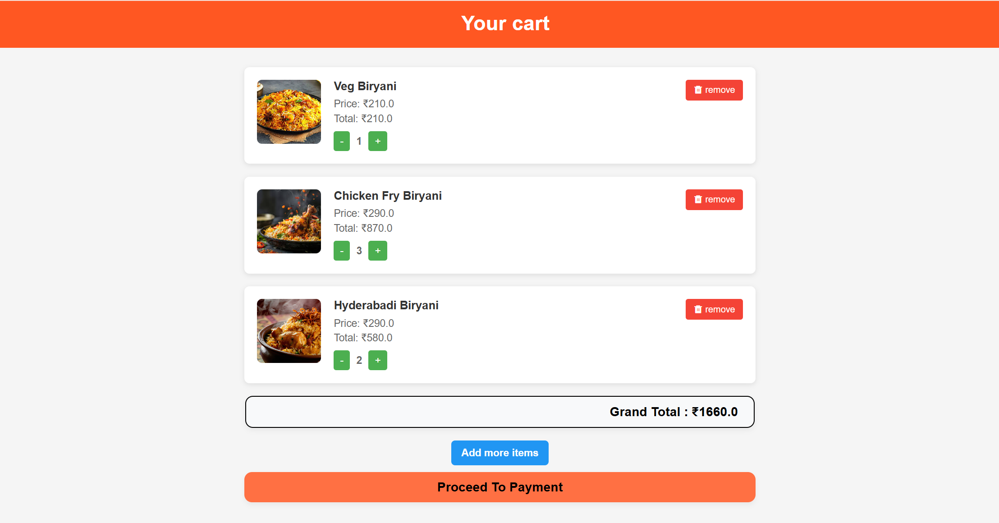
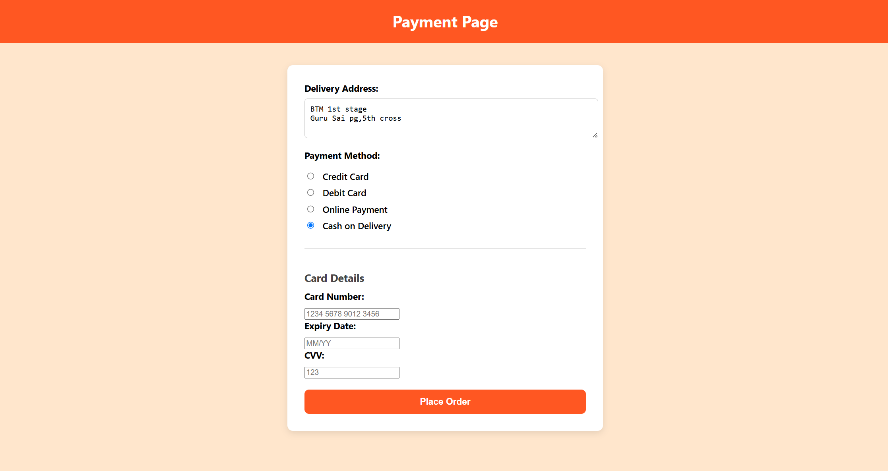
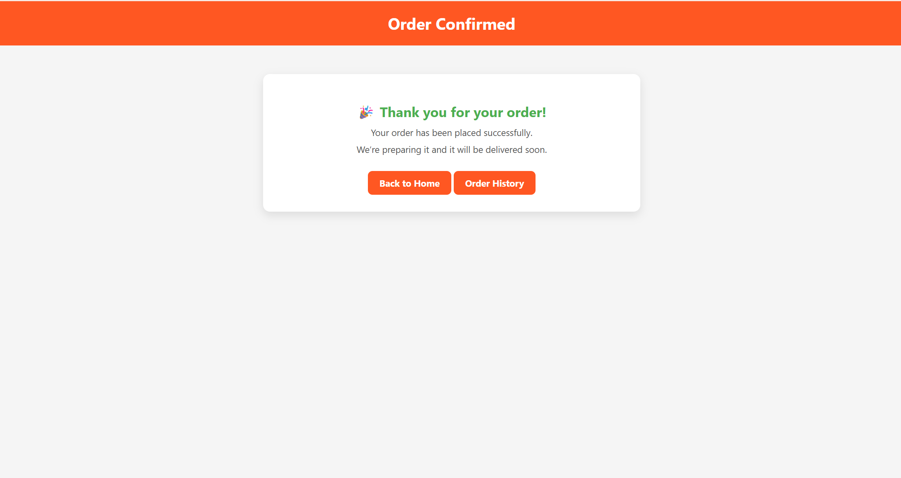
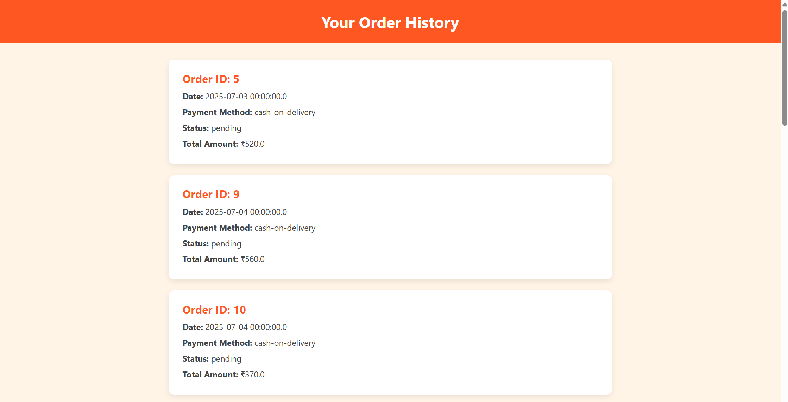
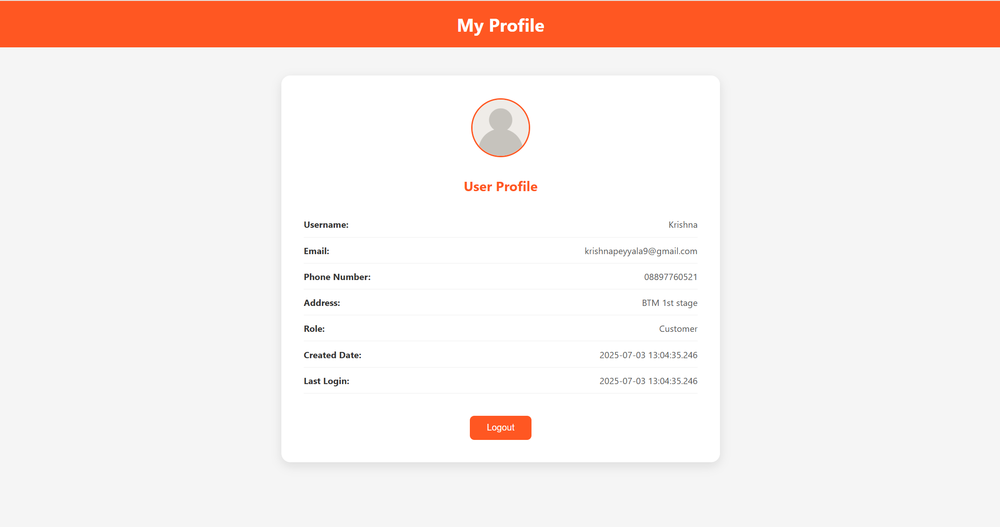

# 🍔 FoodExpress – Food Delivery Application

**FoodExpress** is a full-stack food delivery web application designed to provide a seamless online food ordering experience. Users can browse restaurants, view menus, place orders, manage their profile, and track their order history.

---

## 🔹 Features

- **User Authentication** – Secure login and registration using J2EE and Servlets  
- **Restaurant & Menu Browsing** – Dynamically fetches restaurant and menu data from the database  
- **Order Management** – Place orders and view full order history  
- **Profile Management** – Update and manage user profile information  
- **Responsive UI** – Clean and user-friendly interface using HTML, CSS, and JavaScript  

---

## 🛠️ Tech Stack

- **Frontend:** HTML, CSS, JavaScript  
- **Backend:** Java (J2EE, Servlets)  
- **Database:** MySQL (using JDBC for connectivity)  
- **Architecture:** DAO Design Pattern  

---

## 🚀 Installation & Setup

1. **Clone the repository:**

```bash
git clone https://github.com/KRISHNAPEYYALA19/Food-Express-Application.git
```
## 📷 Screenshots

### 🔐 Login Page


### 📝 Sign Up Page


### 🍽️ Restaurant Home Page


### 🍽️ Restaurant Bottom Section


### 📋 Menu Page


### 🛒 Cart Page


### 💳 Payment Page


### ✅ Order Confirmation Page


### 🧾 Order History Page


### 👤 Profile Page



---

## 📜 License

This project is available for **viewing purposes only**.  
No part of this code may be **copied**, **modified**, **distributed**, or **used in any form** without **explicit written permission** from the author.

See the full **[LICENSE](LICENSE)** file for more details.  
© 2025 Peyyala Krishna. All rights reserved.


